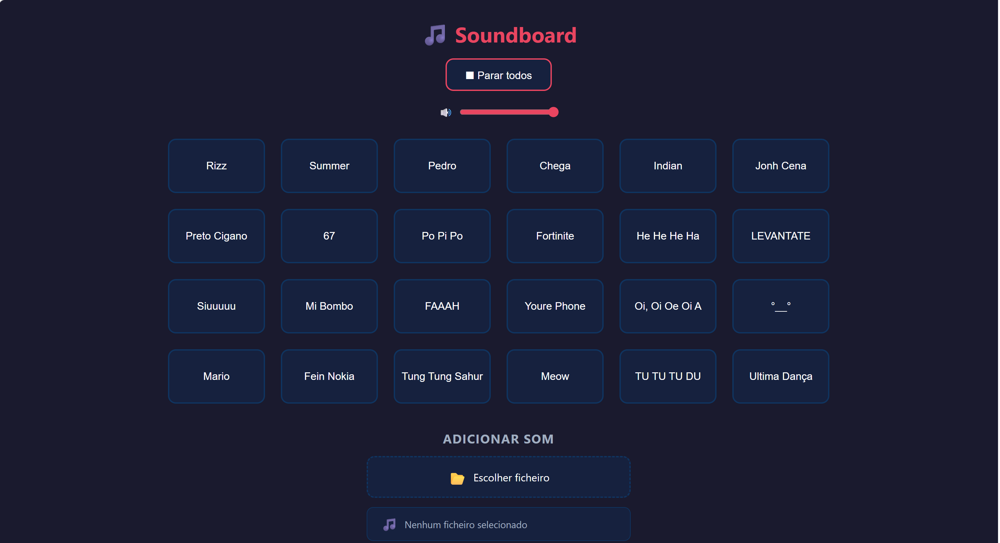

# 🎵 Soundboard JS

Projeto desenvolvido no âmbito da disciplina de Engenharia de Software.
Curso de Engenharia de Computação Gráfica e Multimédia — ESTG-IPVC

## 🌐 Demo ao Vivo
[Abrir Soundboard](https://vieira3030.github.io/2026-ecgm-eds-ab3-soundboard/)

## Descrição
Soundboard web em JavaScript puro com 24 botões de som, upload de sons personalizados, controlo de volume e modo escuro/claro.

## Funcionalidades
- 24 botões com sons pré-definidos
- Upload de sons personalizados (.mp3, .wav, .ogg)
- Controlo de volume global
- Modo escuro / claro com preferência guardada
- Feedback visual nos botões durante reprodução
- Validação de formatos de ficheiro

## Como instalar localmente
1. Clonar o repositório: `git clone https://github.com/vieira3030/2026-ecgm-eds-ab3-soundboard.git`
2. Entrar na pasta: `cd 2026-ecgm-eds-ab3-soundboard`
3. Abrir o ficheiro `index.html` no browser

## Como usar
1. Clica num botão para reproduzir o som
2. Para adicionar um som próprio, clica em "Escolher ficheiro" e seleciona um ficheiro .mp3, .wav ou .ogg
3. Para parar o som clica em "Parar todos"
4. Usa o slider para controlar o volume
5. Clica no 🌙/☀️ para alternar entre modo escuro e claro

## Tecnologias
- HTML5
- CSS3
- JavaScript (Web Audio API, FileReader API, localStorage)

## Grupo
- Afonso Manuel Gomes
- Rodrigo Malheiro
- Rodrigo Vieira

## Screenshots
