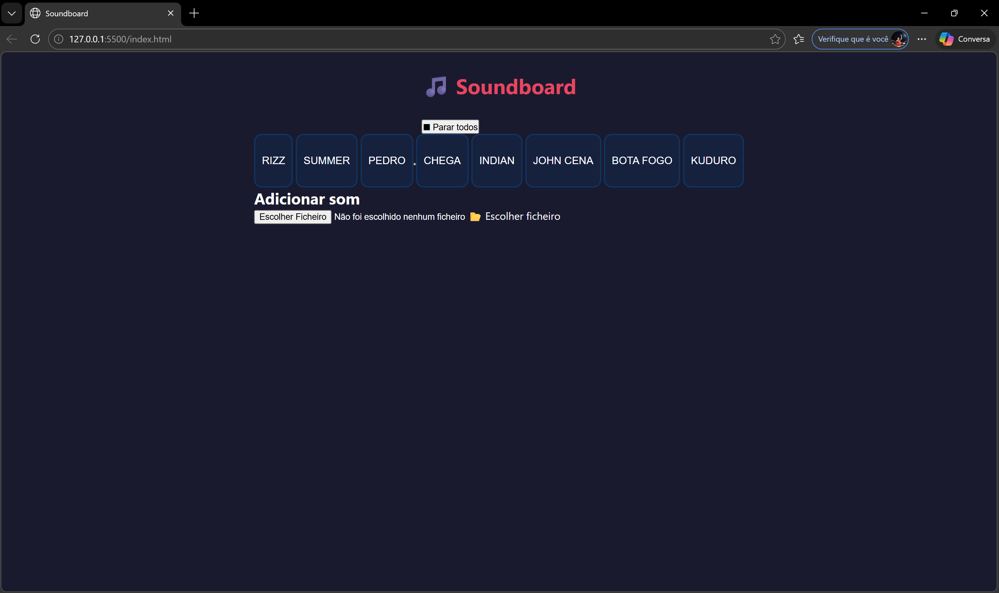

# Soundboard JS

Projeto desenvolvido no âmbito da disciplina de Engenharia de Software.

## Descrição
Soundboard web em JavaScript puro que permite reproduzir sons com botões e fazer upload de sons personalizados.

## Funcionalidades
- Reproduzir sons pré-definidos com botões
- Upload de sons personalizados (.mp3, .wav, .ogg)

## Como correr localmente
1. Clonar o repositório: `git clone https://github.com/SEU_UTILIZADOR/soundboard.git`
2. Abrir o ficheiro `index.html` no browser

## Grupo
- Afonso Manuel Gomes 
- Rodrigo Malheiro
- Rodrigo Vieira

## Tecnologias
- HTML5
- CSS3

- JavaScript (Web Audio API)
## Como usar
1. Abre o ficheiro `index.html` no browser
2. Clica num botão para reproduzir o som
3. Para adicionar um som próprio, clica em "Adicionar som" e escolhe um ficheiro .mp3 ou .wav
4. Para parar todos os sons clica em "Parar todos"

## Screenshots
